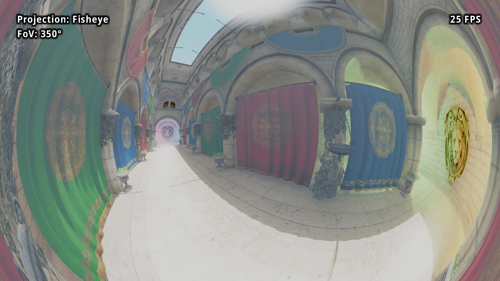

# Godot360
This is an attempt at making a 360° camera in Godot, to allow for both panoramic shots and non-rectilinear FoVs, such as the Panini projection, which can display FoVs of 120-150° with less distortion than the standard rectilinear projection.

I started working on this for two reasons: one of my own projects could benefit from a proper fisheye camera, and to follow up on [this issue on Godot's repo](https://github.com/godotengine/godot/issues/7340).

## Globes and lenses
The code is based on [these](https://github.com/shaunlebron/blinky) [repos](https://github.com/shaunlebron/flex-fov), with a single standard cube "globe" (I may try to add edge-centered and corner-centered cubes for performance), and the following lenses:
* Rectilinear: This is the standard projection, the FoV cannot reach nor exceed 180°; distortion in the corners is quite noticeable at an FoV of 120°, and the center of the image gets heavily compressed.
* Panini: Allows for natural looking scenes at wider angles than the rectilinear projection, can lose straight lines when looking up or down
* Fisheye: Popular wide angle lens, edges get compressed and bent
* Stereographic: Displays both poles at 360° FoV
* Cylindrical: What you would obtain if you flattened a cylinder
* Equirectangular: General panorama projection
* Mercator: Usually used for maps
* Fulldome: An adaptation of the fisheye lens that conforms to a format used to do video projection in planetariums

Note that I am no expert on those projections, you can find much more details about them from better sources.

## Getting started
The process of enabling 360° rendering is fairly easy:
* Add a Camera360 node to your scene (you can replace an existing camera or add it as a child of your original camera if you do not want to move code around)
* Set up exports of the Camera360 node
* Make sure the Camera360's cull mask only sees the same layer as the MeshQuad used for rendering (more details below), and remove this layer from all other cameras, meshes, etc.

Note that the resolution export applies to all six cameras, as well as the clip_near and clip_far properties. I recommend not changing the Camera360's own clip planes nor its FoV as they have no effect.

## Demo controls
The included demo allows you to change lenses (projections) and display an overlay of the original cameras:
* L switches to the next lens/projection
* G toggles the grid overlay
* Use Numpad +/- or the mouse wheel to change the horizontal FoV in increments of 5°
* Click the left or right mouse buttons to make the camera spin either direction

Feel free to add this camera to other projects, following is a screenshot from the [Sponza demo](https://github.com/Calinou/godot-sponza).

## How this works
The Camera360 node creates 6 cameras with a 90° FoV looking in all directions. Each camera renders to a dedicated Viewport, whose texture is passed to the QuadMesh's fragment shader. The QuadMesh is made fullscreen and displays the final image obtained from the distorted views according to the chosen projection.

## Drawbacks of this method
While it allows for more control over what is displayed on screen, and allows for panoramic shots, this technique comes with several problems of its own:
* Rendering time is greatly increased as the game needs to render 6 images for a complete 360° capture.
* Artefacts are visible at the seams, due to screen-space effects (e.g. bloom).
